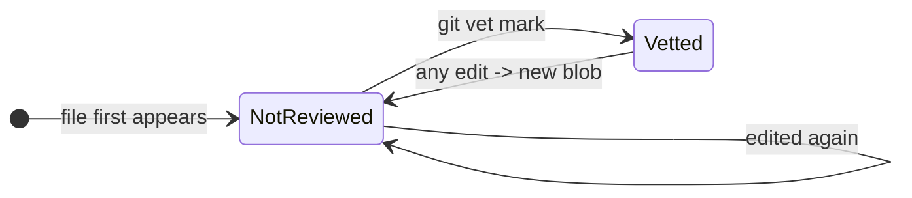

# git-vet — Specification

**Spec version:** 0.1 (for implementation)
**Status:** Draft, intended as the contract for human + AI-agent implementation.

---

## 1. Purpose

`git-vet` tracks a per-file, per-channel **review state** — *reviewed* vs *not reviewed* — for the files tracked in a Git repository, stored entirely in Git itself.

It exists to run a review pipeline that is **independent of the PR/merge pipeline**. You can keep PR review lightweight (merge AI-written code fast, without reading every line) while running a stricter, parallel review that walks the codebase file by file, and gate a release on *every file being reviewed*.

The unit of review is **file content**: reviewing a file means signing off on its exact bytes as they are at `HEAD`. Any later modification — by a human or an AI agent, through any commit — invalidates that sign-off automatically.

---

## 2. Goals and non-goals

### Goals

- Record, in Git, which files' current content has been human-reviewed within a selected review channel.
- Make "not reviewed" the default for any new or modified content, with zero manual bookkeeping to invalidate stale sign-offs.
- Support reviewing only the **diff since the last sign-off**, not the whole file, when a prior reviewed version exists.
- Provide a release gate: succeed only if every in-scope tracked file is reviewed.
- Work offline, locally, and sync across machines/teammates through channel-scoped notes refs.

### Non-goals (explicitly out of scope for v1)

- **No authorship tracking.** The tool does not know or care whether content was written by a human or an AI. There is no git-ai dependency and no AI/human distinction in the model.
- **No PR gating.** It does not block merges or integrate with the PR pipeline. It is a parallel process.
- **No per-line review state.** Review is per file (per blob), not per line or per hunk.
- **No scope seeding / onboarding markers.** Because there is no authorship bit, every tracked file is in scope by default; onboarding a legacy repo requires no special state (see §8).
- Submodules and untracked files are not handled in v1.

---

## 3. Concepts and definitions

- **Blob OID** — the Git object ID of a file's content. `HEAD:<path>` resolves to the blob OID of `<path>` at `HEAD`. Identical content always has the same blob OID.
- **Review channel** — an independent review pipeline. Channel names are flat names (no `/`) to avoid Git ref prefix collisions; the default channel is named `default`; commands use it unless `--channel <name>` is passed.
- **Reviewed set** — for a channel, the set of blob OIDs that carry a note in `refs/notes/vet/<channel>`. A blob is "reviewed" iff it is a member of the selected channel's set.
- **Vetted (stored state)** — a file is *vetted* iff its current blob OID (at `HEAD`) is in the selected channel's reviewed set. This is the only persisted state. Everything else is derived.
- **Sign-off** — the act of adding the file's current blob OID to the selected channel's reviewed set (`git vet mark`).

The stored model is binary within each channel: a blob is reviewed, or it is not. "Not reviewed" is never written down; it is the absence of a note in that channel.

---

## 4. State model

Stored state per file is binary within a channel. Because the key is the blob, any edit produces a new blob with no note in that channel, so the file drops out of *reviewed* with no explicit action.



For presentation, *not reviewed* is split into two **derived** sub-states (not stored — computed at read time by §7.1):

| Derived state | Meaning | Review mode |
|---|---|---|
| `vetted` | current blob is in the selected channel's reviewed set | nothing to do |
| `stale` | current blob not reviewed in the selected channel, but some **earlier** version of this path was | diff review (baseline → HEAD) |
| `new` | current blob not reviewed in the selected channel, and no earlier version of this path was either | full review |

The release gate treats both `stale` and `new` as "not reviewed" in the selected channel.

---

## 5. Data model and storage

### 5.1 Notes refs and channels

All state lives in channel-scoped notes refs:

```text
refs/notes/vet/<channel>
```

The default channel is `default`, so the default notes ref is:

```text
refs/notes/vet/default
```

Each note is attached to a **blob** object (not a commit), keyed by the blob OID. The presence of the note in the selected channel's notes ref is the signal; the body is provenance only. The old unchannelled ref `refs/notes/vet` is not part of the data model.

### 5.2 Note body

The body is an append-only set of review records, one per line, so the same content reviewed more than once in the same channel (or by more than one person in that channel) accumulates an audit trail:

```
{"vetted_at":"2026-06-06T12:30:00+09:00","vetted_by":{"name":"User Name","email":"user@example.com"},"commit":"<sha-at-vet>","path":"src/foo.rs"}
```

- `vetted_at` — ISO 8601 timestamp.
- `vetted_by.name` — from `git config user.name`.
- `vetted_by.email` — from `git config user.email`.
- `commit` — the `HEAD` SHA at vet time (provenance; the blob is the real key).
- `path` — the path vetted (provenance only; a blob can appear at multiple paths).

Records are stored sorted/deduplicated by `git-vet`, and notes merges use the same line-unioning semantics (§5.4), so re-marking identical content is idempotent.

### 5.3 Sync

Notes refs are **not** pushed or fetched by default. The tool must make this easy for the selected channel:

- Push: `git push <remote> refs/notes/vet/<channel>:refs/notes/vet/<channel>`
- Fetch through a temporary ref before merging: `+refs/notes/vet/<channel>:<temporary-notes-ref>`
- `git vet sync [--remote <name>] --channel <channel>` wraps fetch + merge + push of this ref.
- Remote selection is stable and not branch-upstream-dependent: explicit `--remote <name>`, then `vet.syncRemote`, then `origin`, otherwise fail.

### 5.4 Merge strategy

Concurrent sign-offs (different machines, different blobs) must not clobber each other. `git-vet` must not mutate repository or user Git config automatically for this. When `git-vet` merges notes refs, it passes the line-unioning strategy explicitly for that merge:

```sh
git notes --ref=vet/<channel> merge -s cat_sort_uniq <notes-ref>
```

If an equivalent Git operation lacks a dedicated strategy option, use command-scoped config (`git -c notes.mergeStrategy=cat_sort_uniq ...`) instead of persistent config. Users who merge `refs/notes/vet/*` manually may optionally configure `notes.mergeStrategy=cat_sort_uniq` themselves.

With per-blob, line-record bodies this makes merges conflict-free for the common case (different blobs → different note objects; same blob → records union/dedup).

### 5.5 Pruning

Notes for blobs that no longer exist anywhere in the repo accumulate slowly. `git notes --ref=vet/<channel> prune` removes them for a channel. Expose as `git vet prune [--channel <channel>]`. (Trade-off: prune drops sign-off for content not currently present in that channel — acceptable, since absent content has nothing to gate.)

---

## 6. Command surface

Invoked as `git vet <cmd>`, `git-vet <cmd>`, or `vet <cmd>` (§10) — identical behavior in all three. Commands that operate on one selected channel accept global `--channel <channel>`; if omitted, `vet.channel` from Git config is used; if that config key is unset, `default` is used. Channel transfer commands name both endpoints explicitly and reject `--channel` (§6.3).

| Command | Behavior |
|---|---|
| `git vet mark [--allow-dirty] <paths…>` | Sign off the current blob of each path in the selected channel: append a review record note in `refs/notes/vet/<channel>` keyed on `HEAD:<path>`. Idempotent. |
| `git vet status [--workspace] [--json] [--check] [paths…]` | Classify every in-scope tracked file matching the optional file/directory pathspecs (§7.1) as `vetted` / `stale` / `new` in the selected channel and report. With no paths, classify every in-scope tracked file. By default this uses committed `HEAD` content; `--workspace` uses current local working-tree content for tracked files that still exist locally. |
| `git vet diff [--workspace] <path>` | Show the change that still needs review for `<path>` in the selected channel: the cumulative diff from its last-reviewed version to `HEAD`, or to the local working-tree file with `--workspace` (§7.2). |
| `git vet review [--allow-dirty] <paths…>` | Convenience: `diff` then prompt then `mark` for each path in the selected channel. |
| `git vet log <path>` | Show provenance records for the current blob of `<path>` in the selected channel (who reviewed this content, when, at which commit). |
| `git vet unmark <paths…>` | Remove the note on the current blob of each path in the selected channel, forcing re-review. (Affects all paths sharing that blob in that channel — see §9.) |
| `git vet channel list [--json]` | List local review-note channels, sorted by channel name. `--json` emits `{ "channels": [ { "name": str, "ref": str } ] }`. This command does not use `--channel`. |
| `git vet channel copy <source> <destination>` | Copy the source channel's complete local review-notes ref into a new destination channel. |
| `git vet channel move <source> <destination>` | Atomically move the source channel's complete local review-notes ref to a new destination channel. |
| `git vet channel remove <channel> [--force]` | Remove the channel's complete local review-notes ref after confirmation. |
| `git vet sync [--remote <name>]` | Fetch, merge, and push `refs/notes/vet/<channel>` using the selected remote. |
| `git vet prune` | Remove notes for blobs no longer present in the selected channel (`git notes --ref=vet/<channel> prune`). |

For `mark` and `review`, targeted paths whose working-tree contents differ from `HEAD` produce a warning that git-vet signs off only committed `HEAD:<path>` bytes. Interactive users must confirm before proceeding; non-interactive use fails unless `--allow-dirty` is passed. `--allow-dirty` keeps the warning but skips the prompt.

### 6.1 `status` output modes

- Default: human-readable grouping by derived state, including the active channel.
- `--workspace`: classify current local working-tree contents instead of committed `HEAD` contents. A working-tree edit to a vetted `HEAD` blob is `stale` with the vetted `HEAD` blob as its baseline. Tracked files deleted from the working tree have no current content and are excluded in this mode.
- `--json`: object `{ "channel": str, "files": [ { "path": str, "state": "vetted"|"stale"|"new", "blob": oid, "baseline": oid|null, "last_vetted_at": str|null, "vetted_by": { "name": str, "email": str }|null } ] }`.
- Optional path arguments limit output/checking to tracked files matching those file or directory pathspecs. Multiple pathspecs are unioned. Unmatched explicit pathspecs are usage errors. `.vetignore` and `.vetignore.<channel>` are still applied after path filtering.
- `--check`: release-gate mode for the selected channel. Print the unreviewed files; **exit non-zero** if any selected in-scope file is `stale` or `new` in that channel.

### 6.2 Exit codes

- `0` — success; for `--check`, all in-scope files are `vetted`.
- `1` — for `--check`, one or more in-scope files are not reviewed.
- `2` — usage / runtime error (not a Git repo, bad path, etc.).

### 6.3 Channel transfers

`channel copy` and `channel move` operate on local notes refs only:

```text
refs/notes/vet/<source>
refs/notes/vet/<destination>
```

Both endpoint names are required and validated as normal flat review-channel names. The endpoints must differ, the source ref must exist, and the destination ref must not exist. Missing sources and existing destinations are errors. The commands never implicitly merge or replace destination review state.

`channel copy` creates the destination at exactly the source ref's current object ID and retains the source. Subsequent writes to either channel are independent. `channel move` creates the destination at that same object ID and deletes the source in one guarded ref transaction. The transaction verifies the source's observed object ID and the destination's absence so concurrent changes fail rather than being discarded.

The complete notes ref is transferred without enumerating or rewriting note bodies. This includes notes on historical blobs not present at `HEAD`; provenance records remain byte-for-byte unchanged.

Transfers do not consult or modify `vet.channel`, `.vetignore`, `.vetignore.<channel>`, the working tree, or remote refs, and they perform no network access. `--channel` is rejected because both endpoints are explicit. Publish the destination with a separate `git vet --channel <destination> sync`. Moving a local source does not delete a source ref that already exists on a remote.

### 6.4 Channel removal

`channel remove` operates on one explicitly named local channel:

```text
git vet channel remove <channel> [--force]
```

The channel name is validated as a normal flat review-channel name. The local ref `refs/notes/vet/<channel>` must exist. Removal deletes that ref as a whole without enumerating or rewriting note bodies. It does not modify `vet.channel`, `.vetignore` files, working-tree files, or remote refs, and performs no network access.

Interactive removal requires confirmation. Non-interactive removal fails unless `--force` is passed. `--channel` is rejected because the target channel is explicit. Removing a channel is irreversible locally; a remote copy, if any, is unaffected.

### 6.5 Color output

Human-readable output accepts the global option `--color=<auto|always|never>`, which may appear before or after the subcommand. `auto` emits ANSI color only when the relevant output stream is a terminal; `always` forces color; and `never` suppresses it. `--json` output is never colored.

When `--color` is omitted, a non-empty `NO_COLOR` selects `never`, a non-empty `FORCE_COLOR` selects `always`, and otherwise `auto` is used. An empty `NO_COLOR=` is treated as unset. Explicit `--color` takes precedence over both environment variables; when both environment variables are set, `NO_COLOR` takes precedence over `FORCE_COLOR`.

---

## 7. Key algorithms

### 7.1 Classify a path

```
cur := blob_oid(HEAD, path)            # git rev-parse HEAD:<path>
if cur ∈ reviewed_set(channel): return Vetted
for b in historical_blobs(path):       # git log --follow -- <path>, newest→oldest, excluding cur
    if b ∈ reviewed_set(channel): return Stale(baseline = b)
return New
```

For `status --workspace`, `cur` is the blob that Git would produce from the working-tree file. The baseline search first considers the committed `HEAD:<path>` blob as a synthetic predecessor when it differs from `cur`, then continues through committed history as above.

- `reviewed_set(channel)` is loaded **once** per invocation: list every note in `refs/notes/vet/<channel>`, collect the annotated blob OIDs into a `HashSet<Oid>`. Membership tests are O(1).
- The history walk runs only when `cur` is not vetted, and is bounded to the single path via `--follow` (which also tracks the baseline across renames).

### 7.2 Diff to review

```
classify(path):
  Vetted        -> report "up to date", no diff
  New           -> full review: diff empty-tree → cur (the whole file)
  Stale(base)   -> diff base → cur for this path (cumulative change since last sign-off)
```

With `--workspace`, use the same baseline selection but compare to the local working-tree file instead of `HEAD`:

```
classify(path):
  Vetted        -> diff cur → worktree(path)
  New           -> diff empty-tree → worktree(path)
  Stale(base)   -> diff base → worktree(path)
```

Binary files: defer to Git's binary-diff behavior; "full review" of a binary means inspecting it out of band.

### 7.3 Release gate (`status --check`)

```
reviewed_set := load once for selected channel
fail := false
for path in in_scope(git ls-files):    # minus ignored paths (§9.4)
    if current_blob(path) ∉ reviewed_set:
        print path
        fail := true
exit(1 if fail else 0)
```

The gate never walks history: an unreviewed file fails regardless of whether it is `new` or `stale`, so only the cheap membership test is needed. (The `new`/`stale` distinction is computed only for `status` display and `diff`/`review`.)

---

## 8. Workflow

### 8.1 Steady state

1. Code lands on `main` through the normal, lightweight PR pipeline — no `git-vet` involvement, nothing blocked.
2. In parallel, on your own schedule, you review files. `git vet status` shows the backlog (`new` + `stale`) for the default channel; use `--channel <name>` for another review pipeline.
3. For a file, `git vet diff <path>` (or `git vet review <path>`) shows what to read in the selected channel — the whole file if `new`, just the change since the last sign-off in that channel if `stale`. Use `git vet diff --workspace <path>` to include uncommitted local edits in the review diff.
4. `git vet mark <path>` signs off the current content in the selected channel.
5. Any subsequent edit by anyone produces a new blob, dropping the file back into the backlog automatically.
6. `git vet sync` shares the selected channel's state across machines/teammates.
7. At release, `git vet status --check [--channel <name>]` gates on the whole tree being reviewed in that channel. Add path arguments to gate only selected files or directory subtrees.

### 8.2 Onboarding a non-new (legacy) repository

No special handling. On install, every channel's reviewed set is empty, so **every tracked file reads as `new`** in that channel — the entire existing tree is the initial review backlog, which is exactly the desired starting point. Work it down incrementally with `review`/`mark`; gate with `--check` once the backlog (minus ignored paths) is empty. There is no seeding step, no baseline marker, and no authorship inference — this simplicity is the direct payoff of dropping authorship from the model.

### 8.3 Multi-machine / team / independent pipelines

State is shared per channel by pushing/fetching `refs/notes/vet/<channel>` (§5.3) with `cat_sort_uniq` merge (§5.4). Sign-offs are per-content within a channel, so two people reviewing different files in the same channel never conflict; two people reviewing identical content in the same channel simply produce two provenance records on the same blob.

Different channels are independent. Reviewing a blob in `default` does not mark it reviewed in `security`, `release`, or a personal channel such as `alice`.

---

## 9. Edge cases and required behaviors

1. **Renames.** State is blob-keyed, so identical content at a new path stays `vetted` (the current blob is still in the set). `--follow` finds the baseline for `stale`/`diff` across renames.
2. **Identical content in multiple files.** They share one blob and therefore one note within a channel: reviewing one marks all in that channel. This is intentional ("review the content"). `log`/provenance records the paths. Document this behavior; do not try to defeat it.
3. **Deleted files.** Not in `git ls-files`, so excluded from `status` and the gate. Their notes linger until `prune`.
4. **Garbage-collected blobs.** Orphaned notes; cleaned by `prune`.
5. **Path not at HEAD / untracked.** Only `git ls-files` paths are in scope. `mark`/`diff` on an untracked or nonexistent path is a usage error (exit 2).
6. **Working-tree vs HEAD.** Review state is defined against committed content (`HEAD:<path>`), not the dirty working tree. Marking signs off the committed blob; uncommitted edits are not considered. (Implementation may warn if the working tree differs from `HEAD` for a path being marked.)
7. **Submodules.** Out of scope in v1; skip gitlink entries.

### 9.4 Ignore lists

`status`/`--check` consult ignore policy files using gitignore syntax, so generated, vendored, and lockfile paths can be excluded and "everything reviewed" is attainable. Ignore policy is a plain gate-scope filter only — not scope-seeding state, and it stores nothing in notes.

Ignore rules are loaded from repo-root policy files in this order:

1. `.vetignore` — global rules that apply to every channel.
2. `.vetignore.<channel>` — rules that apply only to the exact active review channel.

The per-channel path uses the same hidden base filename with a channel suffix, e.g. channel `security` uses `.vetignore.security`. Missing policy files are treated as empty. Since later gitignore rules win, channel-specific rules can use negation (`!path`) to re-include a path ignored by `.vetignore`.

All patterns are interpreted relative to the repository root, including patterns loaded from `.vetignore.<channel>`. Ignore policy files themselves are tracked files like any other; unless explicitly ignored by policy, changes to `.vetignore` and `.vetignore.<channel>` remain in the review scope.

---

## 10. Packaging and invocation

- Single Rust binary named `git-vet` (`[[bin]] name = "git-vet"`). Git's wrapper turns `git vet …` into an exec of `git-vet …` automatically when the binary is on `PATH` — no registration or manifest. The subcommand token is consumed by Git, so argv is identical whether invoked as `git vet mark x` or `git-vet mark x`; **do not dispatch on argv[0]**.
- Optionally ship a `vet` symlink/alias to the same binary for a bare short form.
- `cargo install git-vet` is the install path; `git vet` lights up with no further wiring.
- Ship `git-vet.1` so `git help vet` works; `git help -a` and completion discover `git-*` binaries on `PATH`.
- **Path resolution:** when run as `git vet`, Git sets `GIT_PREFIX` to the subdirectory the user invoked from. Resolve user-supplied relative paths against the repository prefix (gix repository discovery, or `git rev-parse --show-prefix`) so `git vet mark foo.rs` from a subdirectory means the same file as the direct invocation. Normalize once, up front.
- **Channel option:** `--channel <channel>` is global and may appear before or after subcommands that operate on one selected channel. Channel selection priority is explicit `--channel <channel>`, then Git config `vet.channel`, then built-in `default`. Channel names from either CLI or config must be flat names with no `/`, and must form a valid Git ref when appended to `refs/notes/vet/`. The no-`/` rule avoids Git ref namespace prefix collisions such as `refs/notes/vet/team` versus `refs/notes/vet/team/security`. If configured `vet.channel` is present but empty or invalid, exit with a usage/runtime error unless a valid explicit `--channel` overrides it. `channel copy` and `channel move` do not perform this selection: they validate their explicit source and destination independently and reject `--channel`.
- **Shadowing caveat:** Git prioritizes its own builtins over `PATH`. If Git ever shipped a builtin `vet`, `git vet` would resolve to it; direct `git-vet`/`vet` invocation is immune. No such builtin exists today.

---

## 11. Implementation notes

- Language: Rust. CLI: `clap` (derive).
- Git access: `gix` for repository discovery, blob resolution, ref enumeration, and history walking. **Notes read/write may be shelled out to `git notes --ref=vet/<channel> …`** if `gix` notes support is insufficient; isolate this behind a small `NotesStore` trait so the backend can be swapped.
- Load the selected channel's reviewed set once per command into a `HashSet<gix::ObjectId>`.
- Keep the history walk (`--follow`) confined to `diff`/`review`/`status`-display; never run it in the gate path.
- Determinism: `status --json` output should be stably ordered (sort by path) for diff-friendly CI use.

---

## 12. Design rationale (informative)

- **Channel + blob-keyed, not commit- or path-keyed:** reviewing is signing off on *content within a review pipeline*. Blob-keying makes invalidation automatic (new content ⇒ new key ⇒ no note in that channel), survives rebase/squash (same content ⇒ same key), is robust to revert-to-identical, and follows renames for free.
- **No authorship:** authorship via hooks can only attribute content created after install, which makes legacy onboarding require a scope-seeding mechanism. Dropping authorship makes "in scope" universal and "not reviewed" the natural default, eliminating that machinery entirely.
- **Notes, not a tracked manifest:** keeps review state off the main tree (no history pollution, no per-review commits, no merge conflicts on a shared file), at the cost of explicit push/fetch refspecs per channel.
